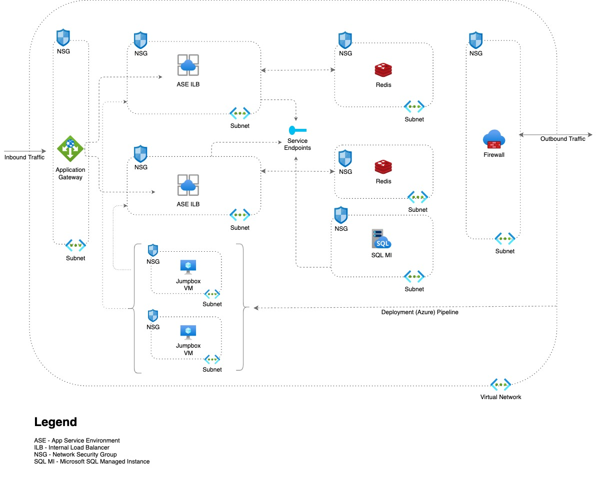
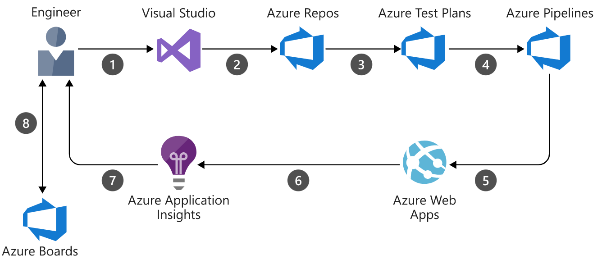

# Deployment of a Highly Available Multi-Region Web APP To Azure.

## Architecture
The App Service Environment (ASE) is the main component of this structure and it is deployed as an internal ASE with internal IP associated with the internal load balancer (ILB). As the requirement of an ASE, it must be deployed in it’s own subnet. Web apps can be deployed in one or more App Service Plans. Resources needed by the application such as compute, storage, scaling, are taken care of by the app service environment where necessary.

This deployment is replicated across 2 regions and availability zones to improve the resiliency of the deployment.

Other important resources needed in the ASE architecture include the following:
### Azure Virtual Network
Deployed across all availability zones within a single azure region. This architecture creates a subnet within the VNET for each ASE deployment per availability zone.
###Application Gateway (v2 for zone redundancy)
This is a web traffic load balancer that helps to manage traffic to web applications. It spans multiple availability zones per azure region which means, a single application gateway is enough for this highly available infrastructure.
###Azure Firewall
This is a managed, cloud-based network security service that protects the Azure Virtual Network resources. It's a fully stateful firewall as a service with built-in high availability and unrestricted cloud scalability. It can span across multiple availability zones.
###Azure Active Directory
This is a multi-tenant, cloud-based identity and access management service that is highly available, redundant, and spans through availability zones and regions. Azure AD provides access rights and permissions management to Azure resources and services.
###Azure Pipelines
This supports parallel processing of CI/CD activities. Since the ASEs are internal to the virtual network, With pipelines, you can simultaneously deploy the built applications to multiple ASE subnets, through multiple jumpbox VMs or Bastion subnets. This architecture uses two jumpbox virtual machines to help with the simultaneous deployment. 
###Azure Redis Cache
is not a zone-aware service. This architecture creates two subnets to hold the Redis Cache, each pinned down to the availability zone of an ASE subnet.
##Deployment Considerations
By using one jumpbox virtual machine per availability zone per region, pins the VM to the same zone and region used by the ASE resources thereby ensuring uptime in the deployment in case of failure either at a zone or region. It also helps parallelize deployment by using VMs as Azure pipeline agents.

###CI/CD Strategy
Azure Pipelines, the component of Azure DevOps Services that brings automation for application builds and deployments will be utilised for CI/CD processes. This tool will help in:
- Accelerating the application development and development lifecycles.
- Building quality and consistency into an automated build and release process
- Increasing application stability and uptime.

The data flows through the below scenario:
1. A developer changes application source code.
2. Application code including the web.config file is committed to the source code repository in Azure Repos.
3. Continuous integration triggers application build and unit tests using Azure Test Plans.
4. Continuous deployment within Azure Pipelines triggers an automated deployment of application artifacts with environment-specific configuration values.
5. The artifacts are deployed to Azure App Service.
6. Azure Application Insights collects and analyzes health, performance, and usage data.
7. Developers monitor and manage health, performance, and usage information.

###Infrastructure As Code (IaC)
I propose using Azure Resource Manager Templates to automate deployments. Resource Manager templates are declarative text files containing a description of Azure resources to be deployed. Resource Manager templates are specific to Azure, and its most important advantage is the extensive coverage of Azure resource types and properties which in some cases Terraform doesn’t support. Also for flexibility of deployments, Azure powershell could come handy at some point.

###Monitoring
Azure Monitor will be used to analyze the availability and performance of the web application, utilizing services such as Azure Application Insights added to the code during development using the SDK to collect application telemetry and also analyze application health, performance and usage information; also drill into monitoring data with log analytics for troubleshooting and deep diagnostics, create visualizations with Azure dashboards.
With Azure monitor, data can be collected from variety of sources such as:

- **Application monitoring data**: Data about the performance and functionality of the code you have written, regardless of its platform.
- **Guest OS monitoring data**: Data about the operating system on which your application is running. This could be running in Azure, another cloud, or on-premises.
- **Azure resource monitoring data:** Data about the operation of an Azure resource.
- **Azure subscription monitoring data**: Data about the operation and management of an Azure subscription, as well as data about the health and operation of Azure itself.
- **Azure tenant monitoring data**: Data about the operation of tenant-level Azure services, such as Azure Active Directory.

##Go-Live Strategy
Highlighted below are high level steps that need to be taken prior to going live in the new environment.

- **Consider the application or data**: Not every application is right for the cloud. Some legacy applications, applications with sensitive data may not be suitable for public cloud. Application data is a high determinant of whether to choose between a private or hybrid cloud

- **Choose Cloud Platform**: Choosing the right cloud environment is important with respect to the nature of application to be deployed. For example it’s best to go with MS Azure for .NET application deployments as it has rich tooling for all deployment strategies. I will also recommend Amazon Web Services for open source applications/languages.

- **Governance and Security**: As organizations move data to the public cloud, the enterprise control of the environment decreases and responsibility of managing the public cloud rests on the cloud providers. Thus firms have to shape governance strategies to build security based on the cloud providers offerings.
Map out security implementations to be carried out.

- **Evaluate Costs**: Moving to public cloud can be cost efficient as the cloud migration reduces hardware and IT staff needs/expenses. Also, with tools like AWS calculator and Azure Pricing Calculator helps to take into account the cost of our infrastructure.

- **Deployment:**  Build out the new environment with required features and automation. At this stage, no need flipping the switch to going live yet. 

- **Test & Validation:** After having carried out previous steps, then it’s important to test and validate the new environment incrementally with just a few information. Carryout stress test, validate the automation, security, and all components for the new environment is fully utilised. After this reaches an Okay state before flipping the switch to going live.
